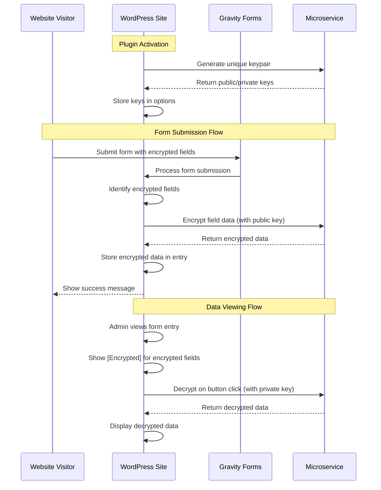

# Design Document: Post-Quantum Encryption Fix

## Overview

This design addresses the core functionality gaps in the Post Quantum Lattice Shield system to provide working encryption/decryption for Gravity Forms. The solution focuses on completing the missing form processing logic, ensuring proper OQS library integration, and providing a seamless user experience for field-level encryption.

### Key Design Principles

- **Simplicity First**: Focus on getting basic encryption/decryption working reliably
- **Graceful Degradation**: Fall back to RSA if OQS library is unavailable
- **Site Isolation**: Each WordPress site maintains independent encryption keys
- **User-Friendly**: Simple checkbox interface for marking fields as encrypted
- **Transparent Operation**: Encryption happens automatically without user intervention

## Architecture

### High-Level Flow



### Component Architecture

```mermaid
graph TB
    subgraph "WordPress Plugin"
        A[Plugin Activation] --> B[Key Generation]
        C[Form Field Settings] --> D[Encryption Checkbox]
        E[Form Submission Hook] --> F[Field Encryption]
        G[Entry Display] --> H[Decrypt Button]
    end
    
    subgraph "Microservice API"
        I[/generate-keypair] --> J[OQS Key Generation]
        K[/encrypt] --> L[Post-Quantum Encryption]
        M[/decrypt] --> N[Post-Quantum Decryption]
    end
    
    subgraph "Gravity Forms Integration"
        O[Field Editor] --> D
        P[Form Processing] --> F
        Q[Entry Management] --> H
    end
    
    B --> I
    F --> K
    H --> M
    D --> O
    F --> P
    H --> Q
```

## Components and Interfaces

### 1. WordPress Plugin Core Functions

#### Key Management
```php
class PQLS_KeyManager {
    public function generate_site_keys() {
        // Call microservice to generate unique keys
        // Store in wp_options with site-specific prefixes
    }
    
    public function get_public_key() {
        // Retrieve site's public key
    }
    
    public function get_private_key() {
        // Retrieve site's private key (for decryption)
    }
}
```

#### Form Field Processing
```php
class PQLS_FormProcessor {
    public function process_form_submission($form) {
        // Identify fields marked for encryption
        // Encrypt field values before storage
        // Handle encryption errors gracefully
    }
    
    public function encrypt_field_value($value, $field_id) {
        // Call microservice encrypt endpoint
        // Return encrypted data or handle errors
    }
}
```

#### Entry Management
```php
class PQLS_EntryManager {
    public function display_encrypted_field($field_value, $field) {
        // Show [Encrypted] placeholder with decrypt button
    }
    
    public function decrypt_field_ajax() {
        // Handle AJAX decrypt requests
        // Call microservice decrypt endpoint
    }
}
```

### 2. Gravity Forms Integration

#### Field Settings Enhancement
```javascript
// Add encryption checkbox to field settings
fieldSettings.text += ', .pqls_encrypt_setting';
fieldSettings.textarea += ', .pqls_encrypt_setting';
fieldSettings.email += ', .pqls_encrypt_setting';
// Add to other sensitive field types

// Field setting HTML
<li class="pqls_encrypt_setting field_setting">
    <input type="checkbox" id="field_pqls_encrypt" onclick="SetFieldProperty('pqls_encrypt', this.checked);" />
    <label for="field_pqls_encrypt">Encrypt this field</label>
</li>
```

#### Form Submission Hook
```php
add_filter('gform_pre_submission_filter', 'pqls_encrypt_fields');

function pqls_encrypt_fields($form) {
    foreach ($form['fields'] as &$field) {
        if (!empty($field['pqls_encrypt']) && !empty($_POST["input_{$field['id']}"])) {
            $encrypted_value = PQLS_FormProcessor::encrypt_field_value(
                $_POST["input_{$field['id']}"], 
                $field['id']
            );
            $_POST["input_{$field['id']}"] = $encrypted_value;
        }
    }
    return $form;
}
```

### 3. Microservice Enhancements

#### Improved Error Handling
```javascript
// Enhanced encrypt endpoint with fallback
exports.handler = async (event) => {
    try {
        // Try post-quantum encryption first
        const pqResult = await attemptPostQuantumEncryption(data, publicKey);
        return successResponse(pqResult, 'post-quantum');
    } catch (pqError) {
        console.warn('Post-quantum encryption failed, falling back to RSA:', pqError.message);
        
        try {
            // Fallback to RSA encryption
            const rsaResult = await attemptRSAEncryption(data, publicKey);
            return successResponse(rsaResult, 'rsa-fallback');
        } catch (rsaError) {
            return errorResponse('Both post-quantum and RSA encryption failed');
        }
    }
};
```

#### Library Status Endpoint
```javascript
// New endpoint: /status
exports.handler = async (event) => {
    const status = {
        oqs_available: false,
        supported_algorithms: [],
        fallback_available: true,
        timestamp: new Date().toISOString()
    };
    
    try {
        const pqCrypto = new PostQuantumCrypto();
        await pqCrypto.initialize();
        status.oqs_available = true;
        status.supported_algorithms = Object.values(pqCrypto.supportedAlgorithms);
    } catch (error) {
        status.error = error.message;
    }
    
    return { statusCode: 200, body: JSON.stringify(status) };
};
```

## Data Models

### WordPress Options Storage
```php
// Site-specific key storage
$options = [
    'pqls_site_id' => wp_generate_uuid4(),
    'pqls_public_key' => $public_key_base64,
    'pqls_private_key' => $private_key_base64,
    'pqls_algorithm' => 'ML-KEM-768', // or 'RSA-2048' for fallback
    'pqls_key_generated' => current_time('mysql'),
    'pqls_microservice_url' => 'https://postquantumlatticeshield.netlify.app/api'
];
```

### Form Field Configuration
```php
// Gravity Forms field property
$field = [
    'id' => 1,
    'type' => 'text',
    'label' => 'Social Security Number',
    'pqls_encrypt' => true, // New property for encryption
    // ... other field properties
];
```

### Encrypted Data Format
```json
{
    "encrypted": true,
    "algorithm": "ML-KEM-768+AES-256-GCM",
    "data": "base64-encoded-encrypted-data",
    "site_id": "unique-site-identifier",
    "encrypted_at": "2024-01-01T00:00:00Z"
}
```

## Error Handling

### WordPress Plugin Error Handling
```php
class PQLS_ErrorHandler {
    public static function handle_encryption_error($error, $field_id) {
        // Log error details
        error_log("PQLS Encryption Error for field {$field_id}: " . $error);
        
        // Show user-friendly message
        GFCommon::add_error_message('Unable to encrypt sensitive data. Please try again.');
        
        // Prevent form submission
        return false;
    }
    
    public static function handle_key_generation_error($error) {
        // Show admin notice
        add_action('admin_notices', function() use ($error) {
            echo '<div class="notice notice-error"><p>';
            echo 'Post Quantum Lattice Shield: Key generation failed. ';
            echo 'Please check your microservice connection.';
            echo '</p></div>';
        });
    }
}
```

### Microservice Error Responses
```javascript
const ERROR_RESPONSES = {
    OQS_UNAVAILABLE: {
        statusCode: 503,
        body: JSON.stringify({
            error: 'Post-quantum encryption temporarily unavailable',
            fallback: 'Using RSA encryption',
            retry_after: 300
        })
    },
    
    INVALID_KEY: {
        statusCode: 400,
        body: JSON.stringify({
            error: 'Invalid encryption key format',
            suggestion: 'Regenerate keys in WordPress admin'
        })
    },
    
    ENCRYPTION_FAILED: {
        statusCode: 500,
        body: JSON.stringify({
            error: 'Encryption operation failed',
            suggestion: 'Please try again or contact support'
        })
    }
};
```

## Testing Strategy

### Unit Tests
- WordPress plugin key generation and storage
- Form field encryption/decryption logic
- Microservice endpoint functionality
- Error handling scenarios

### Integration Tests
- Complete form submission with encrypted fields
- Entry viewing and decryption workflow
- Multi-site key isolation
- Fallback behavior when OQS is unavailable

### User Acceptance Tests
- Admin can mark fields for encryption via checkbox
- Form submissions work transparently for users
- Encrypted data displays properly in admin
- Decryption works on demand

## Performance Considerations

### WordPress Plugin Optimization
- Cache public key in memory to avoid repeated database queries
- Batch encrypt multiple fields in single microservice call
- Implement request timeout and retry logic
- Use WordPress transients for temporary data

### Microservice Optimization
- Keep OQS library initialized between requests
- Implement connection pooling for database operations
- Add response caching for status endpoints
- Monitor memory usage in serverless environment

## Security Considerations

### Key Management
- Store private keys encrypted in WordPress database
- Use WordPress nonces for all AJAX requests
- Implement proper capability checks for decryption
- Log all encryption/decryption operations

### Data Protection
- Validate all input data before encryption
- Use secure random number generation
- Implement rate limiting on microservice endpoints
- Sanitize error messages to prevent information leakage

## Migration Strategy

### Phase 1: Core Functionality
1. Implement missing form submission encryption logic
2. Add Gravity Forms field settings integration
3. Create entry viewing and decryption interface
4. Test with RSA fallback when OQS unavailable

### Phase 2: OQS Integration
1. Verify OQS library installation in Netlify
2. Test post-quantum encryption end-to-end
3. Implement proper error handling and fallbacks
4. Add status monitoring and logging

### Phase 3: Multi-Site Support
1. Ensure key isolation between sites
2. Test plugin on multiple WordPress installations
3. Verify data cannot be cross-decrypted between sites
4. Add site identification to encrypted data

### Phase 4: Production Hardening
1. Add comprehensive error handling
2. Implement performance monitoring
3. Add security auditing and logging
4. Create user documentation and troubleshooting guides