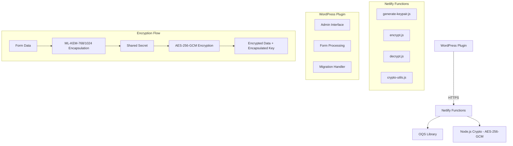

# Design Document: Post-Quantum Migration

## Overview

This design outlines the migration from RSA encryption to genuine post-quantum cryptography using the Open Quantum Safe (OQS) library. The system will implement ML-KEM-768 (formerly Kyber-768) as the default algorithm with optional upgrade to ML-KEM-1024 for maximum security, combined with AES-256-GCM for data encryption, providing quantum-resistant security while maintaining backward compatibility.

### Key Design Principles

- **Hybrid Approach**: Use ML-KEM-768 (default) or ML-KEM-1024 (high security) for key encapsulation + AES-256-GCM for data encryption
- **Configurable Security Levels**: Support ML-KEM-768 and ML-KEM-1024 with admin-selectable security levels
- **Backward Compatibility**: Support both RSA and post-quantum decryption during transition
- **Graceful Degradation**: Clear error handling when OQS library is unavailable
- **Performance Optimization**: Minimize impact on form submission times
- **Security First**: No fallback to weaker encryption methods

## Architecture

### High-Level Architecture



### Encryption Process Flow

1. **Key Generation**: Generate ML-KEM-768 (default) or ML-KEM-1024 keypair using OQS
2. **Encapsulation**: Use public key to generate shared secret and encapsulated key
3. **Data Encryption**: Encrypt form data with AES-256-GCM using shared secret
4. **Storage**: Store encapsulated key + encrypted data + metadata

### Data Format Design

#### Post-Quantum Encrypted Data Format
```json
{
  "version": "pq-v1",
  "algorithm": "ML-KEM-768+AES-256-GCM",
  "securityLevel": "standard|high",
  "encapsulatedKey": "base64-encoded-encapsulated-key",
  "encryptedData": "base64-encoded-encrypted-data",
  "iv": "base64-encoded-initialization-vector",
  "authTag": "base64-encoded-authentication-tag",
  "timestamp": "2024-01-01T00:00:00Z"
}
```

#### Legacy RSA Data Format Detection
```json
{
  "version": "rsa-v1",
  "algorithm": "RSA-OAEP-256",
  "encryptedData": "base64-encoded-rsa-encrypted-data"
}
```

## Components and Interfaces

### 1. OQS Integration Layer (`crypto-utils.js`)

**Purpose**: Centralized wrapper for OQS library operations

**Key Functions**:
- `initializeOQS()`: Verify OQS library availability
- `generateMLKEMKeypair(securityLevel)`: Generate ML-KEM-768 (default) or ML-KEM-1024 keypair
- `encapsulate(publicKey)`: Generate shared secret and encapsulated key
- `decapsulate(privateKey, encapsulatedKey)`: Recover shared secret
- `detectEncryptionType(data)`: Determine if data is RSA or post-quantum encrypted

**Interface**:
```javascript
class PostQuantumCrypto {
  constructor() {
    this.oqs = null;
    this.isInitialized = false;
  }
  
  async initialize() {
    // Load and verify OQS library
  }
  
  async generateKeypair(securityLevel = 'standard') {
    // Returns { publicKey, privateKey, algorithm: 'ML-KEM-768|ML-KEM-1024', securityLevel }
  }
  
  async encrypt(data, publicKey) {
    // Returns encrypted data in new format
  }
  
  async decrypt(encryptedData, privateKey) {
    // Auto-detects format and uses appropriate decryption
  }
}
```

### 2. Enhanced Netlify Functions

#### `generate-keypair.js`
- Generate ML-KEM-768 (default) or ML-KEM-1024 keypairs using OQS
- Include algorithm metadata and security level in response
- Proper error handling for OQS failures

#### `encrypt.js`
- Use ML-KEM-768/1024 + AES-256-GCM encryption
- Return structured data format with metadata
- Performance monitoring and logging

#### `decrypt.js`
- Auto-detect encryption format (RSA vs post-quantum)
- Route to appropriate decryption method
- Maintain API compatibility

### 3. WordPress Plugin Enhancements

#### Migration Handler
- Detect existing RSA keys
- Offer migration to post-quantum keys
- Backup and recovery mechanisms
- Progress tracking for large datasets

#### Admin Interface Updates
- Display current encryption algorithm
- Show OQS library status
- Enhanced testing capabilities
- Migration progress dashboard

#### Form Processing Updates
- Transparent post-quantum encryption
- Backward compatibility for existing encrypted data
- Error handling improvements

## Data Models

### Key Storage Model
```javascript
// WordPress Options
{
  pqls_public_key: "ML-KEM-768/1024 public key PEM",
  pqls_private_key: "ML-KEM-768/1024 private key PEM", 
  pqls_algorithm: "ML-KEM-768|ML-KEM-1024",
  pqls_security_level: "standard|high",
  pqls_key_generated: "2024-01-01 00:00:00",
  
  // Backup during migration
  pqls_rsa_public_key_backup: "RSA public key PEM",
  pqls_rsa_private_key_backup: "RSA private key PEM",
  pqls_migration_status: "completed|in_progress|pending"
}
```

### Encrypted Field Data Model
```javascript
// Database storage format
{
  field_value: "pqls_encrypted::eyJ2ZXJzaW9uIjoicHEtdjEi...",
  encryption_metadata: {
    algorithm: "ML-KEM-768+AES-256-GCM",
    securityLevel: "standard|high",
    encrypted_at: "2024-01-01T00:00:00Z",
    key_id: "key-fingerprint-hash"
  }
}
```

## Error Handling

### OQS Library Errors
- **Library Not Found**: Return HTTP 500 with clear message
- **Algorithm Not Supported**: Log error and return specific failure reason
- **Memory Issues**: Graceful degradation with resource cleanup
- **Key Generation Failure**: Detailed logging with retry mechanism

### Migration Errors
- **Partial Migration**: Rollback mechanism with data integrity checks
- **Key Backup Failure**: Prevent migration until backup is confirmed
- **Decryption Failure**: Maintain access to RSA-encrypted data during transition

### Runtime Errors
- **Invalid Data Format**: Clear error messages without exposing internals
- **Network Timeouts**: Retry logic with exponential backoff
- **Authentication Failures**: Proper HTTP status codes and logging

## Testing Strategy

### Unit Tests
- OQS library integration tests
- Encryption/decryption round-trip tests
- Data format validation tests
- Error handling scenario tests

### Integration Tests
- WordPress plugin to Netlify function communication
- Migration process end-to-end testing
- Backward compatibility verification
- Performance benchmarking

### Security Tests
- Key generation randomness verification
- Encryption strength validation
- Side-channel attack resistance
- Authentication bypass prevention

### Load Tests
- Form submission performance under load
- Memory usage during encryption operations
- Concurrent request handling
- Resource cleanup verification

## Performance Considerations

### Optimization Strategies
- **Key Caching**: Cache OQS library initialization
- **Batch Processing**: Handle multiple encryptions efficiently
- **Memory Management**: Proper cleanup of cryptographic materials
- **Connection Pooling**: Optimize WordPress to Netlify communication

### Performance Targets
- Form submission latency increase: < 200ms
- Memory usage per encryption: < 10MB
- Concurrent request capacity: 100+ requests/second
- Key generation time: < 2 seconds

## Security Considerations

### Cryptographic Security
- Use NIST-approved ML-KEM-768/1024 parameters
- Proper random number generation for all operations
- Secure key storage and transmission
- Authentication tag verification for AES-GCM

### Implementation Security
- Input validation for all cryptographic operations
- Secure memory handling (zero out sensitive data)
- Timing attack prevention
- Error message sanitization

### Operational Security
- Audit logging for all cryptographic operations
- Key rotation procedures
- Backup and recovery protocols
- Access control for decryption capabilities

## Migration Strategy

### Phase 1: Infrastructure Setup
1. Install and configure OQS library in Netlify functions
2. Implement crypto-utils.js with OQS integration
3. Add backward compatibility detection logic
4. Update error handling and logging

### Phase 2: Function Updates
1. Update generate-keypair.js for ML-KEM-768/1024
2. Enhance encrypt.js with post-quantum algorithms
3. Modify decrypt.js for dual-format support
4. Add comprehensive testing

### Phase 3: Plugin Enhancement
1. Add migration detection and UI
2. Implement key backup mechanisms
3. Update admin interface with algorithm display and security level selection
4. Add enhanced testing capabilities

### Phase 4: Migration Execution
1. Generate new ML-KEM-768 (or ML-KEM-1024) keys
2. Backup existing RSA keys
3. Update plugin configuration
4. Verify encryption/decryption functionality
5. Monitor system performance

### Phase 5: Cleanup
1. Remove RSA fallback code (after confirmation period)
2. Clean up backup keys (after extended verification)
3. Update documentation and user guides
4. Performance optimization based on real-world usage